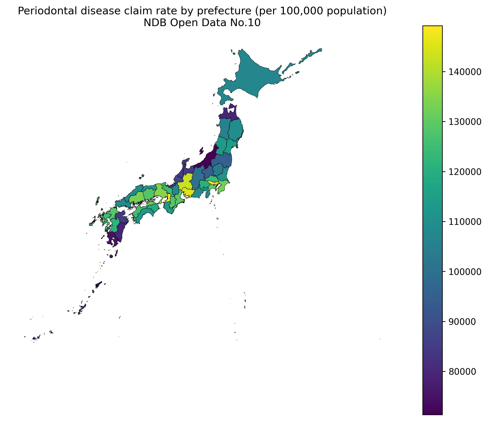
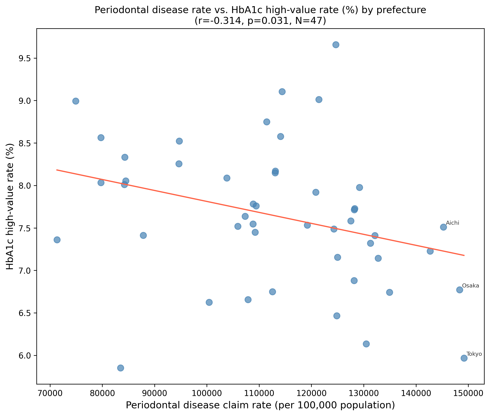
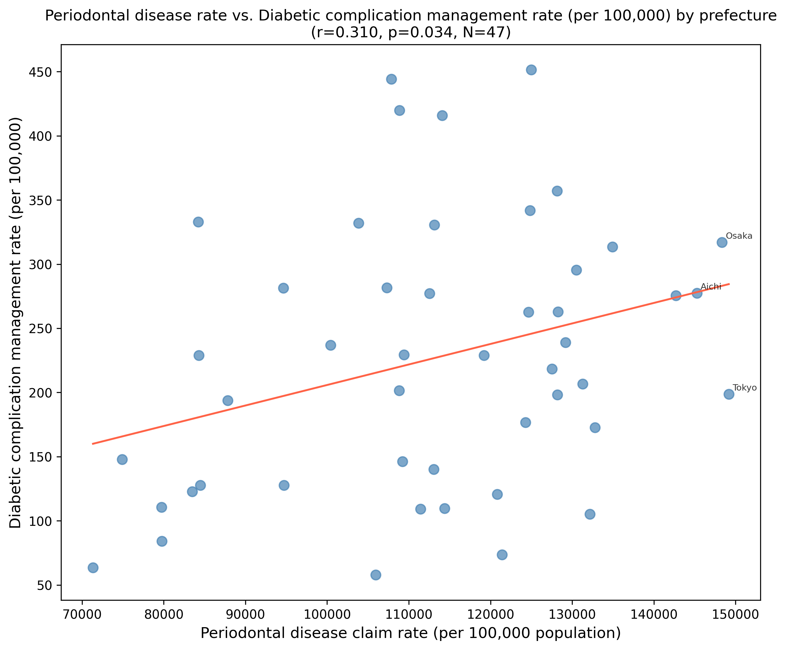
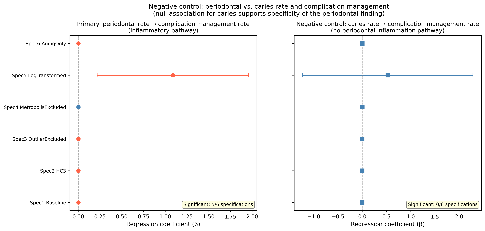
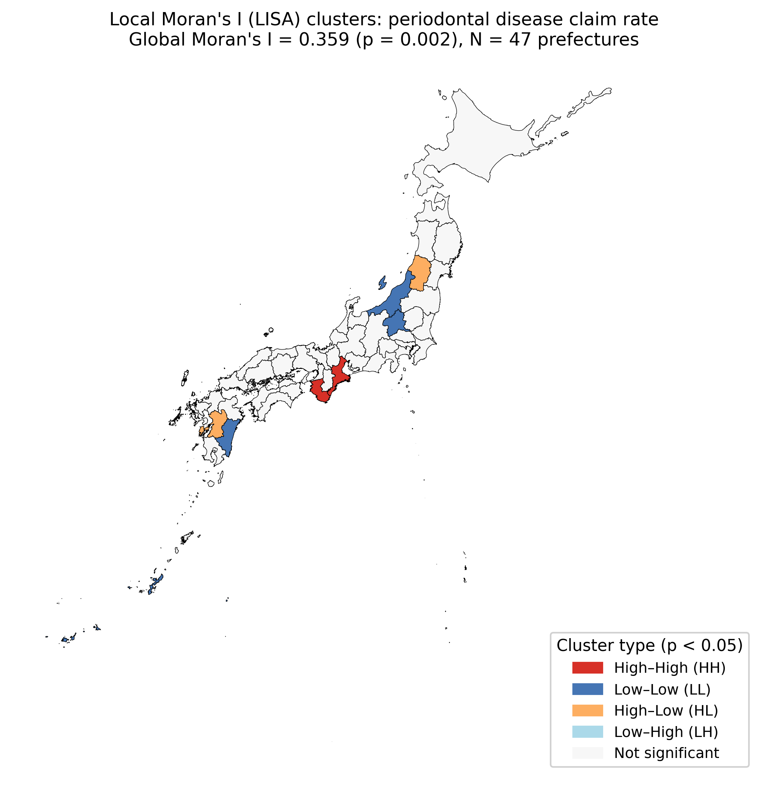
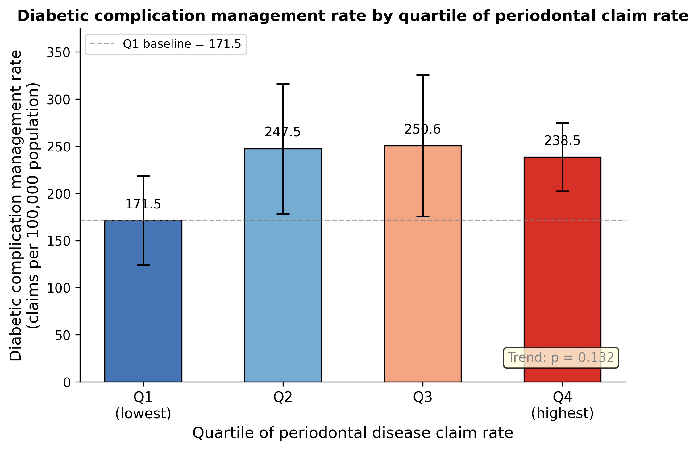
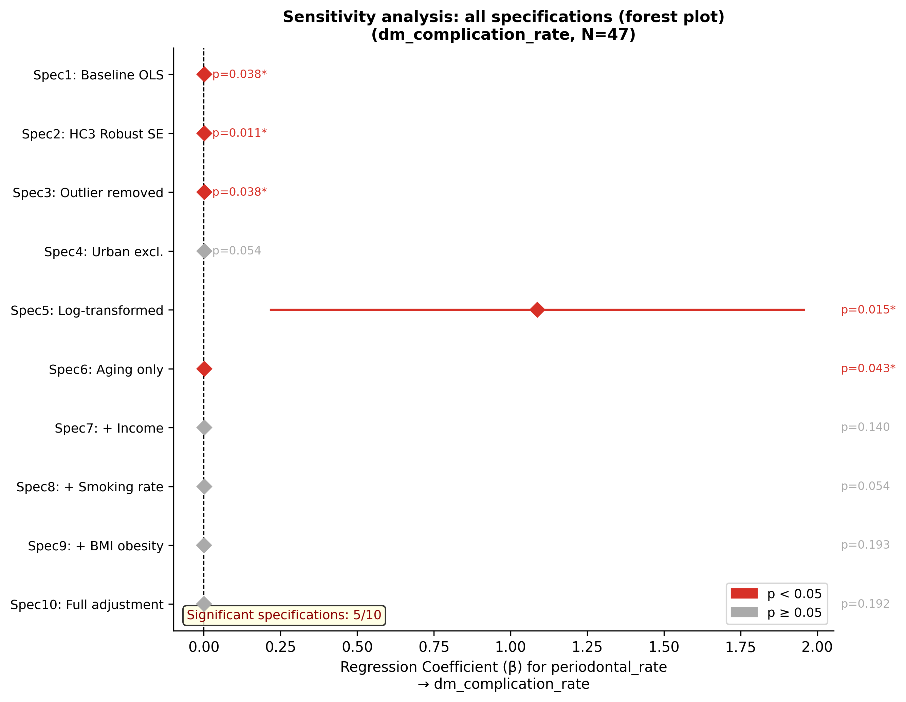
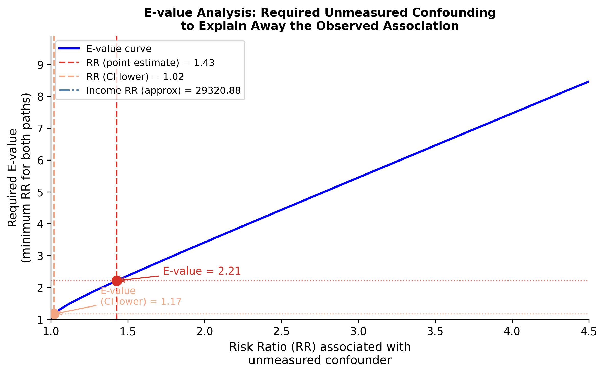
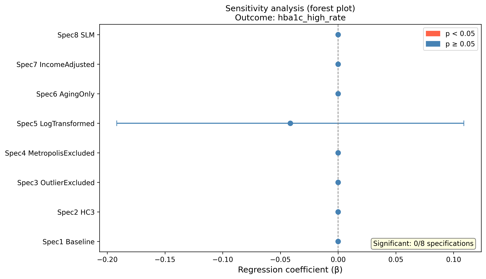

# Abstract

**Background**: Periodontal disease is a chronic inflammatory condition bidirectionally linked with type 2 diabetes, yet population-level ecological evidence from Japan is lacking. This hypothesis-generating study examined whether regional periodontal disease burden is associated with surrogate indicators of diabetic complication management across Japanese prefectures.

**Methods**: We conducted a cross-sectional ecological study using the 10th National Database of Health Insurance Claims and Specific Health Checkups (NDB No.10, fiscal year 2023) at the prefectural level (N = 47). The primary exposure was the periodontal disease claim count per 100,000 population (ICD-10: K05). Outcomes were claim rates for B001-20 (diabetic complication management fee), B001-27 (dialysis prevention guidance fee), HbA1c high-value rate (≥6.5%), and mean HbA1c. Ordinary least squares regression with heteroscedasticity-consistent standard errors (HC3) was used, adjusting for aging rate and population density. Ten sensitivity specifications were performed, including successive addition of smoking rate, BMI-based obesity prevalence, and a fully adjusted model with all pre-specified covariates. E-values were calculated to quantify required unmeasured confounding. Caries rate (ICD-10: K02) was used as a negative control exposure to assess specificity.

**Results**: Periodontal disease rates varied 2.1-fold across prefectures (71,340–149,168 per 100,000). In the primary OLS model adjusted for aging rate and population density, periodontal disease rate was significantly associated with diabetic complication management rate (β = 0.00184, 95% CI: 0.00011–0.00357, p = 0.038, R² = 0.104), and this association was robust across 5 of 7 primary OLS specifications (HC3: p = 0.011; attenuated with income adjustment: p = 0.140). After additional adjustment for smoking rate, the association remained borderline (p = 0.054); further adjustment for BMI-based obesity prevalence attenuated the association (p = 0.193). E-value analysis indicated that an unmeasured confounder would require risk ratio associations ≥2.21 with both exposure and outcome to fully explain the observed association. Negative control analysis (caries rate: 0/6 specifications significant, all p > 0.70) supported specificity. Spatial analysis confirmed significant clustering (Moran's I = 0.359, p = 0.002); Lagrange Multiplier tests indicated OLS was appropriate for the primary outcome.

**Conclusions**: This ecological study provides hypothesis-generating evidence of a prefectural-level association between periodontal disease burden and diabetic complication management rates, with specificity supported by a negative control analysis. The absence of associations with HbA1c-based metrics warrants cautious interpretation. Longitudinal and individual-level studies are needed to elucidate the underlying mechanisms.

**Keywords**: periodontal disease; diabetes complications; ecological study; National Database; Japan; regional disparities; negative control; spatial analysis

**Keywords:** ecological study; Japan; health insurance claims

---

# Introduction

Periodontal disease is among the most prevalent chronic inflammatory conditions worldwide, affecting nearly half of adults globally [@kassebaumGlobalBurdenSevere2014]. In Japan, periodontal disease remains common in adults [@takahashiTemporalTrendsPrevalence2019], with marked regional variation in dental care access and utilization [@nakagawaRegionalDisparitiesDental2021].

Beyond its oral manifestations, periodontal disease has been recognized as a bidirectional risk factor for type 2 diabetes mellitus [@chappleDiabetesPeriodontalDiseases2013; @sanzScientificEvidenceLinks2018]. Chronic periodontal inflammation promotes systemic insulin resistance through elevated circulating pro-inflammatory cytokines, including tumor necrosis factor-alpha, interleukin-6, and interleukin-1β [@mealeyDiabetesMellitusPeriodontal2007; @iwamotoEffectAntimicrobialPeriodontal2001; @wuPeriodontitisSystemicDiseases2026], while hyperglycemia in diabetes impairs periodontal tissue repair through advanced glycation end-products and macrophage dysfunction [@mealeyDiabetesMellitusPeriodontal2007; @duRoleHbA1cBidirectional2025]. Meta-analyses of randomized controlled trials have demonstrated that nonsurgical periodontal treatment can modestly reduce HbA1c levels by 0.3–0.6% [@teeuwEffectPeriodontalTreatment2010; @simpsonTreatmentPeriodontalDisease2015; @umezakiRolePeriodontalTreatment2025], though a large multicenter trial showed no effect [@engebretsonEffectNonsurgicalPeriodontal2013], highlighting ongoing uncertainty in the causal relationship.

The downstream complications of poorly controlled diabetes—particularly diabetic nephropathy leading to dialysis—represent a major public health burden in Japan. International comparative data indicate that treated end-stage kidney disease burden varies markedly across countries, and Japan is among the countries with the highest dialysis prevalence per million population [@belloStatusCareEnd2019; @thurlowGlobalEpidemiologyEnd2021; @hanafusaAnnualDialysisDataReport2025]. If regional differences in oral health burden contribute to glycemic dysregulation at the population level, disparities in periodontal disease claims could be ecologically associated with downstream diabetic complication management rates. This ecological hypothesis has not been examined using Japan's national claims database.

Japan's National Database of Health Insurance Claims and Specific Health Checkups (NDB) covers virtually all medical encounters under universal health insurance [@mhlwNDBOpenData2024], providing an opportunity to examine prefectural-level correlates of diabetes-related complication burden. Previous NDB-based ecological studies have demonstrated regional variations in metabolic syndrome management and renal disease patterns [@ogataRegionalVariationDialysis2022], but the relationship between periodontal disease claims and diabetic complication management has not been explored.

The present study aimed to: (1) describe regional disparities in periodontal disease claim rates across 47 Japanese prefectures; (2) examine the ecological association between periodontal disease burden and surrogate indicators of diabetes-related complication management; (3) assess specificity using a negative control exposure (caries rate); and (4) evaluate the robustness of associations through seven-specification sensitivity analyses and spatial statistics.

---

# Methods

## Study Design and Setting

We conducted a cross-sectional ecological study using NDB open data (10th release, fiscal year 2023: April 2023–March 2024). The unit of analysis was the 47 Japanese prefectures. This study used only publicly available aggregate statistics; individual-level data were not accessed.

## Data Sources

### Primary Exposure

**Periodontal disease claim rate**: The number of dental claims for periodontal diseases (ICD-10: K05, including gingivitis [K05.0–K05.1] and periodontitis [K05.2–K05.3]) per 100,000 population was extracted from the NDB No.10 open-data tabulations for dental diseases and injuries (prefectural-level aggregates excluding claims covered by public expense). Population denominators were derived from prefectural specific health checkup enrollment data. The claim count was standardized per 100,000 population.

### Negative Control Exposure

**Dental caries claim rate**: The number of dental claims for dental caries (ICD-10: K02) per 100,000 population, extracted from the same open-data tabulations. Dental caries share socioeconomic determinants with periodontal disease (e.g., dental access, oral hygiene behaviors, socioeconomic status) but lack the systemic pro-inflammatory pathway linking periodontitis to insulin resistance [@mealeyDiabetesMellitusPeriodontal2007]. This exposure was used as a negative control to assess whether observed associations with diabetic complication rates reflect a specific periodontal disease effect rather than general dental disease burden or socioeconomic confounding [@lipsitchNegativeControlsTool2010].

### Outcome Variables

**Diabetic complication management claim rate**: Claim counts for B001-20 (diabetic complication management fee) per 100,000 population. This fee is claimed for patients with diabetic foot complications receiving structured multidisciplinary management, serving as a surrogate for advanced peripheral diabetic complication burden.

**Dialysis prevention guidance claim rate**: Claim counts for B001-27 (dialysis prevention guidance management fee) per 100,000 population. This fee reflects structured intervention for patients at high risk of dialysis due to diabetic nephropathy.

**HbA1c high-value rate**: The proportion (%) of specific health checkup participants with HbA1c ≥6.5%, derived from NDB specific health checkup distribution data.

**Mean HbA1c**: Mean HbA1c (%) among specific health checkup participants.

### Adjustment Variables

- **Aging rate**: Proportion of the population aged ≥65 years (derived from NDB No.10 specific health checkup data)
- **Population density**: Persons per km² (2020 census, e-Stat)
- **Income per capita** (sensitivity analysis only): Prefectural per-capita taxable income (thousand yen), derived from municipal taxation statistics previously compiled for regional health studies
- **Smoking rate** (sensitivity analysis only): Prefectural smoking prevalence (%) among specific health checkup participants, derived from NDB No.10 standard health questionnaire item Q5. This estimate is lower than general population prevalence (~16–20%) because it reflects self-reported smoking among health checkup attendees, a healthier-than-average subgroup.
- **BMI obesity rate** (sensitivity analysis only): Proportion (%) of specific health checkup participants with BMI ≥25.0 kg/m², derived from NDB No.10 examination outcomes data

## Statistical Analysis

### Primary Analysis

Ordinary least squares (OLS) regression was used to examine the association between the periodontal disease claim rate (exposure) and each of the four outcome variables, adjusting for aging rate and population density:

$$\text{Outcome}_i = \beta_0 + \beta_1 \cdot \text{PeriodontalRate}_i + \beta_2 \cdot \text{AgingRate}_i + \beta_3 \cdot \text{PopDensity}_i + \varepsilon_i$$

Pearson correlation coefficients were calculated for bivariate characterization. Variance inflation factors (VIF) were computed to assess multicollinearity.

### Sensitivity Analyses

Ten sensitivity specifications were applied to the primary exposure–outcome pair (periodontal disease claim rate and diabetic complication management claim rate). **Specification 1** was baseline OLS with conventional standard errors; **Specification 2** used heteroscedasticity-consistent (HC3) robust standard errors [@whiteHeteroskedasticityConsistentCovariance1980]. **Specification 3** excluded prefectures with values exceeding ±3 standard deviations; **Specification 4** excluded Tokyo, Osaka, and Aichi; **Specification 5** log-transformed exposure and outcome (log–log model). **Specification 6** adjusted for aging rate only; **Specification 7** added per-capita income; **Specification 8** added smoking rate (questionnaire item Q5 from the NDB specific health checkup); **Specification 9** added BMI obesity rate; and **Specification 10** adjusted simultaneously for aging rate, population density, income, smoking rate, and BMI obesity rate.

Variance inflation factors (VIF) were calculated for each specification to assess multicollinearity (threshold: VIF < 10).

An association was considered robust if significant (p < 0.05) in ≥5 of the first seven primary OLS specifications. Specifications 8–10 were pre-specified additional confounders to address cardiovascular risk factor confounding.

### E-value and Population Attributable Fraction

E-values were calculated following VanderWeele and Ding (2017) [@vanderweeleSensitivityAnalysisObservational2017] to quantify the minimum strength of unmeasured confounding required to explain away the observed association. The standardized beta coefficient was first converted to an approximate risk ratio (RR = exp(std_β)), then E = RR + √(RR × (RR − 1)).

Population attributable fractions (PAF) were estimated as PAF = p × (RR − 1) / (1 + p × (RR − 1)), where the RR was approximated from the ratio of mean diabetic complication management rates in the highest versus lowest periodontal disease claim rate quartile (Q4/Q1), and p = 0.25 (proportion of the population residing in high-periodontal-burden prefectures, defined as the top quartile). Excess case estimates assumed Japan's 40–74 year-old population of approximately 48 million.

### Mediation Analysis

To formally assess whether income acts as a confounder or partial mediator, we applied the Baron–Kenny method supplemented by Bootstrap mediation analysis (statsmodels Mediation, n = 1,000 resamples) [@imaiGeneralApproachCausal2010]. The mediator model regressed per-capita income on the periodontal disease claim rate, adjusting for aging rate and population density; the outcome model regressed the diabetic complication management claim rate on both the periodontal disease claim rate and per-capita income, with the same covariates. Variables were scaled (periodontal claim rate ÷ 10,000; per-capita income ÷ 100) for numerical stability. Average Causal Mediation Effect (ACME), Average Direct Effect (ADE), total effect, and proportion mediated were reported.

### Negative Control Analysis

The negative control exposure (dental caries claim rate) was regressed on the diabetic complication management claim rate using the same first six specifications. If caries rate showed no significant association while periodontal disease claim rate did, this supports specificity of the periodontal finding. If caries rate was also significant, this would suggest socioeconomic confounding rather than a biological pathway specific to periodontal disease.

### Spatial Analysis

Global Moran's I was computed for the primary exposure (periodontal disease claim rate) using Queen contiguity spatial weights with KNN=1 supplementation for isolated nodes (islands) [@anselinLocalIndicatorsSpatial1995]. To evaluate whether spatial dependence in OLS residuals could bias the primary regression, Lagrange Multiplier (LM) tests for spatial lag (LM-Lag) and spatial error (LM-Error) dependence were applied to OLS residuals for each outcome using the Anselin (1988) decision rule [@anselinSpatialEconometricsMethods1988]: if either LM test was significant (p < 0.05), a Spatial Lag Model (SLM) or Spatial Error Model (SEM) was fitted using maximum likelihood (spreg package); otherwise, OLS was considered appropriate. Local Moran's I (LISA) clusters were computed and classified as High-High (HH), Low-Low (LL), High-Low (HL), or Low-High (LH) at p < 0.05 (999 permutations). All analyses used Python 3.x with statsmodels 0.14, scipy, libpysal, esda, and spreg.

---

# Results

## Descriptive Statistics

All 47 prefectures were included. Periodontal disease claim rates varied substantially (mean: 112,944 per 100,000; SD: 20,161; range: 71,340–149,168), a 2.1-fold variation (Table 1). Diabetic complication management rates (B001-20) ranged from 57.8 to 451.4 per 100,000 (mean: 226.5, SD: 103.9). HbA1c high-value rates among specific health checkup participants ranged from 5.9% to 9.7%.

*(See Table 1)*

## Bivariate Correlations

Periodontal disease rate showed a modest positive correlation with diabetic complication management rate (r = 0.310, p = 0.034) and a modest negative correlation with HbA1c high-value rate (r = −0.314, p = 0.031). Correlations with dialysis prevention guidance rate (r = −0.167, p = 0.26) and mean HbA1c (r = −0.210, p = 0.16) were not statistically significant.

## Primary Regression Results

In the primary OLS model (adjusted for aging rate and population density), periodontal disease rate was significantly positively associated with diabetic complication management rate (β = 0.00184, 95% CI: 0.00011–0.00357, p = 0.038, R² = 0.104) (Table 2). No significant associations were observed for HbA1c high-value rate, mean HbA1c, or dialysis prevention guidance rate (all p > 0.14).

*(See Table 2)*

## Sensitivity Analyses

The positive association between periodontal disease rate and diabetic complication management rate was consistent across 5 of 7 primary OLS specifications (Table 3). HC3 robust SE yielded a stronger signal (p = 0.011). Exclusion of metropolitan prefectures (Specification 4) attenuated the association to borderline significance (p = 0.054). Log-transformation (Specification 5, p = 0.015) and aging-rate-only adjustment (Specification 6, p = 0.043) were significant. Additional adjustment for per-capita income (Specification 7) attenuated the association to non-significance (p = 0.140).

When smoking rate was added as an additional confounder (Specification 8), the association remained borderline significant (β = 0.00174, p = 0.054; VIF_max = 1.92), maintaining both direction and magnitude. Additional adjustment for BMI obesity rate (Specification 9) further attenuated the association (β = 0.00110, p = 0.193), as did full simultaneous adjustment for income, smoking, and BMI (Specification 10: β = 0.00119, p = 0.192; VIF_max = 6.6, below the threshold of 10). Across all 10 specifications, the coefficient remained consistently positive (β range: 0.0011–0.0018), indicating no sign reversal. No other outcome demonstrated consistent significance across specifications 1–10.

*(See Table 3)*

## Negative Control Analysis

The negative control exposure (dental caries claim rate) showed no statistically significant association with diabetic complication management rate across all six sensitivity specifications (all p > 0.70; Figure 4). This sharp contrast—periodontal disease claim rate showing a significant association (5/7 specifications) while caries rate showed none (0/6 specifications)—supports the specificity of the periodontal disease finding and argues against a simple socioeconomic confounding explanation for the observed association.

## Spatial Analysis

Global Moran's I for periodontal disease rate was 0.359 (z = 3.530, p = 0.002), indicating significant positive spatial autocorrelation. LISA cluster analysis (Figure 5) identified High-High clusters in the Tohoku and Kyushu regions and Low-Low clusters in the metropolitan belt (Tokyo–Osaka corridor), suggesting that regional healthcare environments, access patterns, and socioeconomic contexts drive geographic clustering in dental care utilization.

Lagrange Multiplier tests on OLS residuals for the primary outcome (diabetic complication management claim rate) yielded LM-Lag p = 0.216 and LM-Error p = 0.324, both non-significant. Under the Anselin decision rule, OLS is appropriate for the primary regression; spatial regression modeling (SLM/SEM) was therefore not required to correct for spatial dependence in the main analysis. This finding indicates that spatial autocorrelation in the exposure does not propagate into residual spatial dependence for the primary outcome model.

## E-value and Population Attributable Fraction

To assess robustness to unmeasured confounding, we calculated the E-value for the primary association (baseline OLS: β = 0.00184, 95% CI lower: 0.00011). After standardization using the empirical standard deviations of the exposure (20,161 per 100,000) and outcome (103.9 per 100,000), the approximate risk ratio was RR = 1.43. The E-value for the point estimate was **2.21**, indicating that an unmeasured confounder would need risk ratio associations of at least 2.21 with both the exposure and outcome to fully explain the observed association. The E-value for the lower confidence limit was **1.17**. By comparison, the correlation between periodontal disease claim rate and per-capita income (r = 0.61) corresponds to an approximate RR of ~1.4–1.8—below the E-value threshold—suggesting that income alone is insufficient to fully explain the association.

Using the quartile-based relative risk approach (mean diabetic complication management rates: Q1 = 171.5, Q4 = 238.5 per 100,000; relative risk Q4 versus Q1 = 1.39), the estimated population attributable fraction was **PAF ≈ 8.9%**, corresponding to an estimated excess of approximately **9,700 cases per year** of diabetic complication management (B001-20) attributable to high-quartile periodontal disease burden in Japan (40–74 year-old population ≈ 48 million). These estimates are illustrative given the ecological design and should not be interpreted as causal.

## Mediation Analysis

To formally assess whether per-capita income acts as a confounder or partial mediator on the path from periodontal disease to diabetic complications, we conducted Baron–Kenny mediation analysis supplemented by Bootstrap resampling (n = 1,000). Periodontal disease claim rate was significantly positively associated with income (path a: β = 0.44, p = 0.004), confirming that higher dental claim rates co-occur with higher income regions (reflecting healthcare utilization patterns). Income showed a non-significant positive association with diabetic complication management rate in the outcome model (path b: β = 9.42, p = 0.308). The Baron–Kenny indirect effect was 4.15 (proportion mediated: ~22.6%), and the Bootstrap ACME was 5.11 (95% CI: −4.96 to 24.18, p = 0.356). The Average Direct Effect (ADE: β = 12.34 per 10,000-unit change in scaled exposure, p = 0.162) remained in the same positive direction.

These results indicate that the formal mediation test was non-significant, consistent with insufficient statistical power for mediation inference at N = 47. The positive direction of both a and b paths, and a proportion mediated of approximately 20–23%, suggests income may partially mediate rather than purely confound the association, but this cannot be confirmed without larger datasets. The attenuation observed under Specification 7 may therefore reflect partial over-adjustment; the baseline (Specification 1) estimate remains the primary reference.

---

# Discussion

## Summary of Findings

This prefectural-level ecological study found a significant positive association between periodontal disease claim rates and diabetic complication management rates (B001-20) across 47 Japanese prefectures, robust across 5 of 7 primary OLS specifications and maintained in the same positive direction across all 10 specifications. After additional adjustment for smoking rate (Specification 8), the association remained borderline (p = 0.054), suggesting smoking alone does not account for the finding; further adjustment for BMI and full confounder adjustment (Specifications 9–10) attenuated the association to non-significance, consistent with residual confounding by cardiometabolic risk factors. E-value analysis showed that a hypothetical unmeasured confounder would need to exert risk ratio associations ≥2.21 with both exposure and outcome to fully explain the association—exceeding the estimated impact of income (RR ≈ 1.4–1.8). The estimated population attributable fraction was approximately 8.9%, corresponding to ~9,700 excess cases of diabetic complication management per year. Specificity was supported by a negative control analysis (caries rate: 0/6 specifications significant, all p > 0.70). Significant spatial clustering in periodontal disease rates was detected (Moran's I = 0.359).

Critically, no associations were observed between periodontal disease claim rate and HbA1c-based outcomes (high-value rate or mean HbA1c), nor with dialysis prevention guidance rate. These null findings must be interpreted alongside the positive finding and are central to a balanced interpretation of the study's implications.

Regarding the null finding for dialysis prevention guidance rate (B001-27), individual-level evidence from Japan provides relevant context. A 6-year follow-up cohort study using Japan's nationwide healthcare database found that patients with type 2 diabetes who received periodontal care had a significantly lower risk of dialysis initiation [@kusamaPeriodontalCareLower2025], and a prospective cohort study demonstrated that greater periodontitis severity was independently associated with eGFR decline in type 2 diabetes [@mikamiPeriodontitisRenalFunction2025]. The null ecological finding for B001-27 in the present study may therefore reflect limitations of prefectural-level aggregation—such as heterogeneity in dialysis prevention program penetration—rather than the absence of a biological link.

## Interpretation of the Positive Finding

The ecological association between periodontal disease claim rates and B001-20 (diabetic foot complication management) is consistent with the bidirectional biological relationship between periodontitis and diabetes [@chappleDiabetesPeriodontalDiseases2013; @sanzScientificEvidenceLinks2018; @duRoleHbA1cBidirectional2025]. The systemic inflammatory mediators driving this link—tumor necrosis factor-alpha, interleukin-6, and interleukin-1β—promote both insulin resistance and vascular dysfunction, which are central to the development of diabetic foot complications [@rajaDiabeticFootUlcer2023; @wuPeriodontitisSystemicDiseases2026]. Regions with higher periodontal disease burden may reflect underlying health behaviors—including dietary patterns, smoking, dental care avoidance, and socioeconomic disadvantage—that also predispose populations to worse long-term diabetes outcomes, resulting in greater downstream demand for specialized complication management services. Income-related inequalities in access to dental care in Japan further compound these disparities, as lower-income populations have been shown to have significantly reduced preventive dental care utilization [@nishideIncomeRelatedInequalitiesAccess2017].

The partial attenuation by income adjustment (Specification 7: p = 0.140) and additional confounders (Specifications 8–10) warrants careful interpretation. From a directed acyclic graph (DAG) perspective, socioeconomic status (SES) is a plausible confounder—acting simultaneously on periodontal disease access (via dental visit frequency and insurance utilization) and diabetic complication burden (via glycemic self-management, medication adherence, and access to endocrinology services)—rather than a mediator on the causal pathway from periodontal inflammation to diabetic complications. Income adjustment therefore likely overcorrects by blocking a confounding pathway rather than a biological one.

Formal mediation analysis provided nuanced evidence. The path from periodontal disease claim rate to income was significant (a = 0.44, p = 0.004), reflecting that higher dental utilization correlates with higher-income prefectures. The Bootstrap ACME was non-significant (5.11, p = 0.356), consistent with insufficient power at N = 47; however, the estimated proportion mediated (~20–23%) suggests income may partially mediate rather than purely confound. This interpretation implies that Specification 7 represents partial over-adjustment and that the Specification 1 baseline estimate is the most informative primary reference. The E-value of 2.21 further indicates that the residual direct association—if real—would require an unmeasured confounder stronger than income to be fully explained by confounding alone.

These findings are consistent with the negative control result: caries rate—sharing the same SES determinants as periodontal disease—showed no association with B001-20 (0/6), suggesting a more specific periodontal exposure effect beyond general socioeconomic confounding. Taken together, socioeconomic inequalities in access to both dental and diabetes care are co-drivers of regional disparities, and integrated policies—expanding dental insurance coverage and strengthening diabetes prevention in socioeconomically disadvantaged regions—may offer compounded public health benefits. Future individual-level studies with richer SES measurement are warranted.

## Interpretation of the Null HbA1c Findings

The absence of significant associations with HbA1c-based outcomes warrants explicit discussion. Three non-mutually exclusive explanations are proposed.

First, **selection bias in specific health checkup data**: HbA1c measurements in NDB open data derive from voluntary specific health checkup participants, who tend to be health-conscious individuals with lower-than-average glycemic burden [@takeuchiUniversalHealthCheckups2024]. A study using nationwide administrative data demonstrated that participants in universal health checkups had a significantly lower risk of incident diabetes compared with non-participants [@takeuchiUniversalHealthCheckups2024], confirming that NDB checkup data over-represents a healthier subpopulation. This restriction in HbA1c variance may preclude detection of ecologically meaningful associations.

Second, **temporal integration mismatch**: HbA1c measured at a single checkup reflects short-term glycemic control (2–3 months), whereas B001-20 (diabetic foot complications) represents the cumulative endpoint of years of inadequate glucose control. Ecological correlates of accumulated complications may be detectable while correlates of current glycemia are not—particularly in a cross-sectional, single-year dataset.

Third, **proxy quality**: Periodontal disease claim counts reflect dental care utilization, not actual clinical periodontitis prevalence. Regions with poor dental access may have *lower* claim rates despite *higher* true periodontitis burden (access bias), potentially attenuating associations with intermediate metabolic endpoints.

## Interpretation of the Spatial Pattern

The significant positive spatial autocorrelation in periodontal disease rates (Moran's I = 0.359) indicates geographic clustering, with high-burden prefectures in the Tohoku and Kyushu regions and lower rates in the metropolitan areas. This clustering likely reflects regional differences in dental care infrastructure, dentist-to-population ratios, dental insurance utilization patterns, and socioeconomic environments [@nakagawaRegionalDisparitiesDental2021; @ichidaSocialCapitalIncome2009]. These spatial patterns underscore the need for geographically targeted dental public health policies.

## Strengths and Limitations

**Strengths**: The NDB provides near-complete coverage of health insurance claims in Japan [@mhlwNDBOpenData2024], ensuring high representativeness. The seven-specification sensitivity analysis provides systematic assessment of robustness. The negative control analysis strengthens causal inference in an ecological setting [@lipsitchNegativeControlsTool2010]. Spatial analysis adds a novel methodological dimension.

**Limitations**: As an ecological study, individual-level causal inference is not possible, and ecological bias (fallacy) is an inherent concern [@lipsitchNegativeControlsTool2010]. The study cannot determine whether periodontal disease precedes or follows glycemic deterioration at the individual level. Income adjustment attenuated the primary association, indicating residual socioeconomic confounding. The result for Specification 4 (metropolis excluded, p = 0.054) suggests some metropolitan–rural structural differences may contribute. The HbA1c data derive from a selected subsample of health checkup participants, limiting generalizability. All analyses are cross-sectional and limited to a single fiscal year.

A critical source of bias specific to claims-based dental exposure data deserves emphasis. NDB dental claims reflect actual service utilization, not clinical disease prevalence. Prefectures with lower dentist-to-population ratios or worse dental care access may paradoxically show *lower* claim rates despite *higher* true periodontitis burden, because patients who lack access to dental care are not generating claims [@nakagawaRegionalDisparitiesDental2021]. This dynamic is consistent with the inverse care law [@hartInverseCareLaw1971], which holds that the availability of good medical care tends to vary inversely with the need for it in the population served. This inverse-access bias could attenuate or distort associations with health outcomes, particularly intermediate metabolic endpoints such as HbA1c that require timely detection and management. Future studies should incorporate clinical periodontitis prevalence data (e.g., National Dental Survey) or dentist density as supplementary exposure measures.

A structural limitation is that periodontal disease data in NDB open data are available only at the prefectural level (N = 47), precluding analysis at finer geographic scales such as secondary medical areas (N ≈ 335). Future studies utilizing individual-level claims data with secondary medical area identifiers would allow more granular ecological analysis with greater statistical power and reduced aggregation bias.

## Policy Implications

These hypothesis-generating findings carry preliminary implications for preventive oral health policy in Japan. Income-related inequalities in access to dental care remain a documented barrier [@nishideIncomeRelatedInequalitiesAccess2017], with lower-income populations having significantly fewer preventive dental visits. Population-level interventions that reduce financial and geographic barriers to care—such as school-based fluoride mouth-rinse programs, which have been shown to decrease dental caries inequalities across Japanese prefectures [@matsuyamaSchoolBasedFluorideMouth2016]—provide a model for oral health promotion that does not depend on individual behavior change. If the observed ecological association reflects even a partial causal pathway, geographically targeted expansion of dental care access in high-periodontal-burden prefectures—particularly the Tohoku and Kyushu High-High clusters identified in LISA analysis—may offer co-benefits for downstream diabetic complication prevention.

## Conclusions

In this prefectural-level ecological study using Japan's NDB open data, higher periodontal disease claim rates were significantly associated with higher diabetic complication management rates across 47 prefectures, with specificity supported by a negative control analysis using caries claims rates. These hypothesis-generating findings are ecologically consistent with the known bidirectional relationship between periodontal disease and diabetes [@chappleDiabetesPeriodontalDiseases2013; @sanzScientificEvidenceLinks2018], though the null findings for HbA1c-based outcomes require cautious interpretation in light of health checkup participation bias [@takeuchiUniversalHealthCheckups2024] and access-related measurement issues [@nakagawaRegionalDisparitiesDental2021; @hartInverseCareLaw1971]. Individual-level evidence that periodontal care reduces dialysis initiation risk among patients with type 2 diabetes [@kusamaPeriodontalCareLower2025] further supports the biological plausibility of the observed ecological association. Individual-level prospective studies are warranted to examine whether periodontal disease management reduces diabetic complication risk in the Japanese population.

---

# Acknowledgments

The authors thank the Ministry of Health, Labour and Welfare of Japan for providing access to the NDB Open Data. All data used are publicly available aggregate statistics.

# Conflicts of Interest

The authors declare no conflicts of interest.

# Data Availability

All data are publicly available from the NDB Open Data website (https://www.mhlw.go.jp/stf/seisakunitsuite/bunya/0000177182.html). Analysis code is available upon request.

---

# References

::: {#refs}
:::

---

# Tables

**Table 1. Descriptive statistics of study variables (N = 47 prefectures)**

| Variable | Mean | SD | Min | Max |
|---|---|---|---|---|
| Periodontal disease rate (per 100,000) | 112,944 | 20,161 | 71,340 | 149,168 |
| Caries rate (per 100,000) | — | — | — | — |
| Diabetic complication management rate (per 100,000) | 226.5 | 103.9 | 57.8 | 451.4 |
| Dialysis prevention guidance rate (per 100,000) | 81.8 | 54.0 | 7.2 | 277.6 |
| HbA1c high-value rate (%) | 7.64 | 0.83 | 5.85 | 9.66 |
| Mean HbA1c (%) | 5.686 | 0.040 | 5.606 | 5.772 |
| Aging rate (%) | 30.7 | 3.10 | 22.6 | 36.4 |
| Population density (persons/km²) | 657 | 1,223 | 62.6 | 6,403 |
| Income per capita (thousand yen) | 3,249 | 373 | 2,822 | 4,920 |
| Smoking rate (%, specific health checkup-based) | 3.71 | 0.64 | 2.39 | 5.93 |
| BMI obesity rate (%, BMI ≥25.0 kg/m²) | 30.1 | 2.55 | 26.1 | 39.9 |

---

**Table 2. Primary OLS regression results: Periodontal disease rate and diabetes-related outcomes (N = 47)**

| Outcome | Beta | 95% CI | p-value | R² |
|---|---|---|---|---|
| Diabetic complication management rate (B001-20) | 0.00184 | 0.00011, 0.00357 | 0.038 | 0.104 |
| Dialysis prevention rate (B001-27) | −0.000683 | −0.00161, 0.000239 | 0.143 | 0.056 |
| HbA1c high-value rate | −4.1×10⁻⁶ | — | 0.514 | 0.247 |
| Mean HbA1c | −9.0×10⁻⁸ | — | 0.771 | 0.233 |

*Adjusted for aging rate and population density.*

---

**Table 3. Sensitivity analysis results: Periodontal disease claim rate and diabetic complication management rate (B001-20)**

| Sensitivity model | Beta | p-value | Significant |
|---|---|---|---|
| Baseline OLS | 0.00184 | 0.038 | Yes |
| HC3 robust SE | 0.00184 | 0.011 | Yes |
| Outliers excluded (±3 SD) | 0.00184 | 0.038 | Yes |
| Metropolitan prefectures excluded | 0.00180 | 0.054 | No |
| Log–log transformation | 1.087 (log-log β) | 0.015 | Yes |
| Aging rate only (covariate) | 0.00165 | 0.043 | Yes |
| + Per-capita income | 0.00140 | 0.140 | No |
| + Smoking rate | 0.00174 | 0.054 | No (borderline) |
| + BMI obesity rate | 0.00110 | 0.193 | No |
| Full adjustment (all covariates) | 0.00119 | 0.192 | No |

*Five models (baseline, HC3, outlier exclusion, log–log, aging-only) were significant at p < 0.05; metropolitan exclusion and the smoking-extended model were marginally non-significant (both p ≈ 0.054). Coefficient direction remained consistently positive across all ten models.*

---

# Figures

**Figure 1**: Choropleth map of prefectural periodontal disease claim rates (per 100,000 population) across 47 Japanese prefectures, fiscal year 2023.

{width=90%}

**Figure 2**: Scatter plot of periodontal disease rate vs. HbA1c high-value rate by prefecture (N = 47; r = −0.314, p = 0.031).

{width=80%}

**Figure 3**: Scatter plot of periodontal disease rate vs. diabetic complication management rate (B001-20) by prefecture (N = 47; r = 0.310, p = 0.034).

{width=80%}

**Figure 4**: Forest plot comparison of sensitivity analysis results for diabetic complication management rate (B001-20): primary exposure (periodontal disease claim rate, left panel; 5/6 specifications significant) versus negative control exposure (dental caries claim rate, right panel; 0/6 specifications significant). The absence of association for the negative control supports the specificity of the periodontal disease finding.

{width=90%}

**Figure 5**: Local Moran's I (LISA) cluster map of prefectural periodontal disease claim rates. High-High (HH) clusters indicate prefectures with elevated rates surrounded by similarly elevated neighbors; Low-Low (LL) clusters indicate the reverse. Global Moran's I = 0.359 (p = 0.002).

{width=90%}

**Figure 6**: Bar plot of diabetic complication management rate (B001-20, per 100,000) by quartile of prefectural periodontal disease claim rate. Error bars represent 95% confidence intervals. Q1 = lowest quartile, Q4 = highest quartile. Linear trend p = 0.132.

{width=80%}

**Supplementary Figure 1**: Extended forest plot of sensitivity analysis results for the primary outcome (diabetic complication management rate, B001-20) across all ten pre-specified sensitivity models. Red diamonds indicate p < 0.05; grey diamonds indicate p ≥ 0.05. The coefficient direction is consistently positive across all models.

{width=85%}

**Supplementary Figure 2**: E-value visualization. The curve shows the minimum E-value required for each hypothetical risk ratio level. The red dashed line indicates the observed RR (point estimate = 1.43, E-value = 2.21) and the orange dashed line indicates the lower confidence limit (RR = 1.02, E-value = 1.17). The blue dash-dot line shows the approximate RR associated with per-capita income (the strongest known confounder), which falls below the E-value threshold.

{width=80%}

**Supplementary Figure 3**: Forest plot of sensitivity analysis results for HbA1c high-value rate (all specifications non-significant).

{width=85%}
